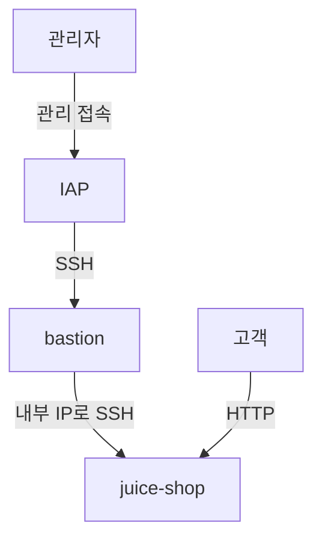

# 01. GCP 관리 접속 경로 보안 검토

프로젝트 완료 후, 기존 template 양식에 따라 재작성할 예정이다.

웹 서버의 고객 접속과 관리자 접속을 구분하고, 방화벽 설정을 점검하는 실습이다. Google Skills의 [Build a Secure Google Cloud Network: Challenge Lab](https://www.skills.google/catalog_lab/2728)을 바탕으로 진행한다.

고객의 HTTP 접근을 유지하면서 관리자는 IAP와 배스천을 거쳐 웹 서버에 접속하도록 구성하는 것이 목표이다. 변경 전 설정, 적용한 규칙, 접속 시험 결과를 함께 기록한다.

**진행 상태: 실습 준비**

## 검토 범위

| 대상 | 확인할 내용 |
|---|---|
| `bastion` | 외부 IP 유무, IAP를 통한 SSH 접속, 네트워크 태그 |
| `juice-shop` | 고객 HTTP 접근, 내부 SSH 접속, 인터넷 직접 SSH 허용 여부 |
| `acme-vpc` 및 관련 서브넷 | VM의 소속 네트워크, 관리 서브넷 주소 범위 |
| 방화벽 규칙 | 소스, 대상, 프로토콜·포트, 우선순위, 사용 여부 |

이번 실습은 네트워크 설정과 접속 경로를 대상으로 한다. Juice Shop 애플리케이션의 취약점 진단은 포함하지 않는다.

## 목표 접속 경로

아래는 랩에서 요구하는 목표 구조이다. 실제 설정과 접속 결과는 실습 후 기록한다.

| 접속 목적 | 허용 범위 | 대상 | 포트 |
|---|---|---|---|
| 배스천 관리 | IAP TCP 전달 소스 범위 | `bastion` | TCP/22 |
| 웹 서비스 이용 | 인터넷 | `juice-shop` | TCP/80 |
| 웹 서버 관리 | `acme-mgmt-subnet`의 실제 CIDR | `juice-shop` | TCP/22 |

관리 서브넷 전체를 허용하는 설정과 배스천 한 대만 허용하는 설정은 범위가 다르다. 이 차이는 최종 검토에 남길 예정이다.

## 진행 순서

### 1. 현재 설정 확인

두 VM의 IP·서브넷·태그와 방화벽 규칙을 수집한다. 규칙이 실제로 어느 VM에 적용되는지 확인하고, 웹사이트의 변경 전 접속 상태를 기록한다.

### 2. 문제와 변경 범위 정리

필요한 접속과 현재 허용 범위를 비교한다. 불필요한 소스·포트·대상이 확인되면 해당 규칙과 판단 근거를 기록하고, 변경에 따른 접속 영향을 정리한다.

### 3. 설정 변경

랩 지침에 따라 방화벽 규칙과 VM 태그를 설정한다. 실제 변경한 값, 작업 순서, 오류와 수정 내용을 기록한다.

### 4. 접속 재검증

변경 후 설정을 다시 수집하고, 새 연결로 정상 경로와 제한 대상 경로를 확인한다.

| 확인 항목 | 기대 결과 |
|---|---|
| 외부에서 웹사이트 HTTP 접속 | 페이지 조회 성공 |
| IAP를 통한 배스천 SSH 접속 | 로그인 성공 |
| 배스천에서 웹 서버 내부 IP로 SSH 접속 | 로그인 성공 |
| 인터넷에서 웹 서버로 직접 TCP/22 연결 | 연결 불성립; 최종 규칙과 함께 원인 검토 |
| 배스천 외부 IP | 미할당 |
| 불필요한 공개 허용 규칙 | 제거 여부 확인 |

SSH 인증 실패와 네트워크 연결 실패를 구분한다. 시간 초과만으로 방화벽 차단을 확정하지 않고, VM 상태와 적용 규칙을 함께 확인한다.

## 기록할 문서

| 파일 | 내용 |
|---|---|
| `reports/01-scope-and-requirements.md` | 대상, 필요한 접속, 검수 기준 |
| `reports/02-current-state.md` | 변경 전 자산·규칙과 적용 관계 |
| `reports/03-findings.md` | 실제로 확인한 문제, 위험, 개선 방향 |
| `reports/04-change-record.md` | 변경 계획, 실제 작업 이력, 오류·복구 기록 |
| `reports/05-validation.md` | 시험 조건, 기대 결과, 실제 결과와 판정 |
| `reports/06-review-summary.md` | 검토 결과, 잔여 위험, 미검증 항목 |

설정과 시험 출력은 `evidence/`, 구성도는 `diagrams/`, 실습용 코드는 `scripts/`에 정리한다. 문서에서 증적 ID를 참조해 판단 근거를 연결한다.

## 결과 기록

실습 후 이 절에 발견한 문제, 변경 내용, 재점검 결과를 요약한다. 현재는 변경 전 설정과 접속 시험 결과를 등록하기 전이다.

## 참고 자료

- [Build a Secure Google Cloud Network: Challenge Lab](https://www.skills.google/focuses/12068?parent=catalog)
- [Google Cloud — Use IAP for TCP forwarding](https://docs.cloud.google.com/iap/docs/using-tcp-forwarding)
- [Google Cloud — VPC firewall rules](https://docs.cloud.google.com/firewall/docs/firewalls)

[전체 프로젝트로 돌아가기](../../README.md)